  <h1>If found, please return to terminal</h1>

  

<h1 align="center">Hi, I'm Leo.</h1>

  I build security programs, developer tooling, weird automation,  
  open source software, and increasingly elaborate systems designed to  
  <a href="https://sdcc.leoreading.dev/">catch Santa</a>. I'm deeply suspicious of manual processes, and mildly  
  obsessed with elegant systems.

  <h3>
    <em>
      I'm perpetually one bad idea away from over-engineering something useful.
    </em>
  </h3>

---

### What I'm Currently Building

- [OWASP Threat Dragon](https://github.com/OWASP/threat-dragon) - open source threat modeling, and yes, objectively the cutest mascot in security
- [slide-spec](https://github.com/lreading/slide-spec) - presentations as structured data, built as and for OSS communities
- [garak-repo](https://github.com/lreading/garak-repo) - visualizing, storing, and comparing [Nvidia garak](https://github.com/nvidia/garak) runs
- [ts-express-framework](https://github.com/lreading/ts-express-framework) - because apparently I _needed_ my own TypeScript framework? 🤡
- [Santa Detection Control Center](https://github.com/lreading/santa-detection-control-center) - highly classified seasonal surveillance infrastructure. **SERIOUSLY, DO NOT LOOK HERE**.

### Pull Requests Welcome

_Strong opinions, not strongly held. I reserve the right to merge more informed arguments._

- Most manual processes are bugs with social acceptance
- Over-engineering is fine if you're having fun and nobody gets hurt
- It's ok to not take a stance on `tabs v spaces`
- UX often improves security outcomes
- Building community is harder than building software, but sometimes more rewarding
- Consistent code is cleaner than "clean" code
- If the workaround has users, it is a product now
- Superstition is silly until someone says “it’s only a one-line fix”

